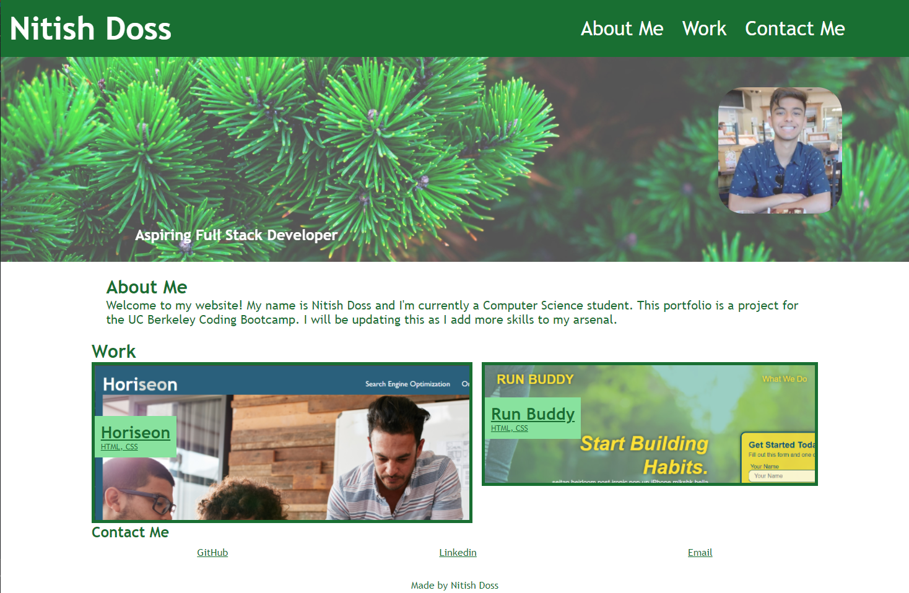

# Professional Portfolio

## The Objective 

My goal was to create a web application from scratch. The application in question was a page for my personal portfolio. I used HTML and CSS to create this, using concepts such as flex boxes, variables, and more. I also included many small details such as transparent grid items when hovered over.

## The Finished Product

Website Link: https://nitishd22.github.io/challenge-02/

Repository Link: https://github.com/nitishd22/challenge-02/
